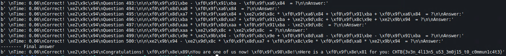

# Alien Camp
## Description
The Ministry of Galactic Defense now accepts human applicants for their specialised warrior unit, in exchange for their debt to be erased. We do not want to subject our people to this training and to be used as pawns in their little games. We need you to answer 500 of their questions to pass their test and take them down from the inside.

## Methodology
This is an `nc` challenge without a source code. When we connect we get this.


We get some emojis which have a number associated with them. Then we take a test and get an equation. The equation is however using those emojis, so we have to substitute them for numbers and solve the equation. However, we are too slow. We need a scripted approach.

```python
#!/usr/bin/python3
                                                          
import socket               
import sys          

def recvuntil(sock,delim = b"\n") :
    data = b""
    while not data.endswith(delim):    
      data += sock.recv(1)
    return data 
                                                          

def sendline(sock,data):    
    sock.send(data + b'\n')
    return 1                     
                                                          

def get_choices(data):
  choices = data[25:len(data)-24]

  d = {}                                                                                                            
  a = choices.split(b' ')             
                                                          
  d[a[0]] = a[2]   
  d[a[3]] = a[5]             
  d[a[6]] = a[8]
  d[a[9]] = a[11]            
  d[a[12]] = a[14]
  d[a[15]] = a[17] 
  d[a[18]] = a[20]               
  d[a[21]] = a[23]
  d[a[24]] = a[26]            
  d[a[27]] = a[29]
                                                          
  return d

  def first_answer(s, data):  
  q = data.split(b'\n\n')[2]
  q = q[:len(q) - 5]
                                                          
  q1 = q.split(b' ')
                                                          
  l = ([choices.get(n, n) for n in q1])
  l = b''.join(l)
  l = l.decode()
  print(l)
  o = eval(l)               
  print(o)      
                                                          
  o = bytes(str(o), 'utf-8')
  sendline(s, o)
  data = recvuntil(s, b'Answer:')                                                                                   
  print(data)

  return data


def answer(s, data):
  q = data.split(b'\n\n')[1]
  q = q[:len(q) - 5]

  q1 = q.split(b' ')

  l = ([choices.get(n, n) for n in q1])
  l = b''.join(l)
  l = l.decode()
  o = eval(l)

  o = bytes(str(o), 'utf-8')
  sendline(s, o)
  data = recvuntil(s, b'Answer:')
  print(data)

  return data

with socket.socket(socket.AF_INET, socket.SOCK_STREAM) as s:
  s.connect(('138.68.178.56', 31136)) 
  data = recvuntil(s, b'\n>')
  sendline(s, b'1')
  data = recvuntil(s, b'\n>')

  choices = get_choices(data)

  sendline(s, b'2')
  data = recvuntil(s, b'Answer:')
   
  data = first_answer(s, data)

  for i in range(498):
    data = answer(s, data)

  print('-------- Final answer')
  q = data.split(b'\n\n')[1]
  q = q[:len(q) - 5]

  q1 = q.split(b' ')

  l = ([choices.get(n, n) for n in q1])
  l = b''.join(l)
  l = l.decode()
  o = eval(l)

  o = bytes(str(o), 'utf-8')
  sendline(s, o)
  data = recvuntil(s, b'}')
  print(data)
```

We connect to the challenge with a `socket` and automate everything. First we parse the choices and create a `dict` for the emoji substitution. Them we perform 500 equations in a loop and at the and get a flag.



## Flag
**CHTB{3v3n_4l13n5_u53_3m0j15_t0_c0mmun1c4t3}**