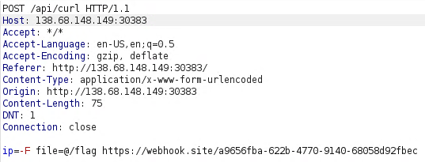
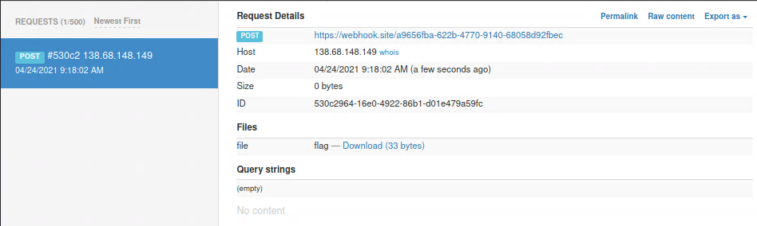
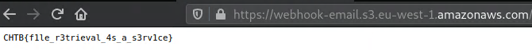

# CaaS
## Description
cURL As A Service or CAAS is a brand new Alien application, built so that humans can test the status of their websites. However, it seems that the Aliens have not quite got the hang of Human programming and the application is riddled with issues.

## Files
Provided docker environment.

## Code
### `index.php`
```php
[REDACTED]

$router = new Router();
$router->new('GET', '/', 'CurlController@index');
$router->new('POST', '/api/curl', 'CurlController@execute' );

[REDACTED]
```

### `controllers/CurlController.php`
```php
<?php
class CurlController
{
    public function index($router)
    {
        return $router->view('index');
    }

    public function execute($router)
    {
        $url = $_POST['ip'];

        if (isset($url)) {
            $command = new CommandModel($url);
            return json_encode([ 'message' => $command->exec() ]);
        }
    }
}
```

### `models/CommandModel.php `
```php
<?php
class CommandModel
{
    public function __construct($url)
    {
        $this->command = "curl -sL " . escapeshellcmd($url);
    }

    public function exec()
    {
        exec($this->command, $output);
        return $output;
    }
}
```

## Methodology
We can perform a `POST` request that does a `curl` request on the backend. Since there is `escapeshellcmd()` method, performing command injection goes out of the window. We can however use our own `curl` cmd options. We can use `-F` option to exfiltrate files from OS as a `POST` request.

```
-F, --form <name=content>

(HTTP SMTP IMAP) For HTTP protocol family, this lets curl emulate a filled-in form in which a user has pressed the submit button. This causes curl to POST data using the Content-Type multipart/form-data according to RFC 2388. This enables uploading of binary files etc. To force the 'content' part to be a file, prefix the file name with an @ sign.
```

As a remote endpoint, we use `https://webhook.site/`.

## Exploit


We get a hit!



The flag is in the file.



## Flag
**CHTB{f1le_r3trieval_4s_a_s3rv1ce}**