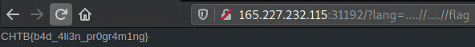

# MiniSTRyplace
## Description
Let's read this website in the language of Alines. Or maybe not?

## Files
Provided docker environment.

## Code
A simple php webpage. The flag is in the root of the page.

### `index.php`
```html
<html>
    <header>
        <meta name='author' content='bertolis, makelaris'>
        <title>Ministry of Defence</title>
        <link rel="stylesheet" href="/static/css/main.css">
        <link rel="stylesheet" href="https://stackpath.bootstrapcdn.com/bootswatch/4.5.0/slate/bootstrap.min.css"   >
    </header>

    <body>
    <div class="language">
        <a href="?lang=en.php">EN</a>
        <a href="?lang=qw.php">QW</a>
    </div>

    <?php
    $lang = ['en.php', 'qw.php'];
        include('pages/' . (isset($_GET['lang']) ? str_replace('../', '', $_GET['lang']) : $lang[array_rand($lang)]));
    ?>
    </body>
</html>
```

## Methodology
We can select a page language, and the relevant `php` file gets included. We can use this to get `LFI`. We have to however bypass the `str_replace` which replaces `'../'` with `''`.  We can use `'....//'` which gets replaced to `'../'`.

## Exploit


## Flag
**CHTB{b4d_4li3n_pr0gr4m1ng}**