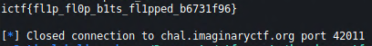

# Flip Flops
## Description
Yesterday, Roo bought some new flip flops. Let's see how good at flopping you are.

## Files
Provided source code

## Code
### `flop.py`
```python
#!/usr/local/bin/python
from Crypto.Cipher import AES
from Crypto.Util.Padding import pad, unpad
import binascii
import os

print('''
                                        ,,~~~~~~,,..
                             ...., ,'~             |
                             \    V                /
                              \  /                 /
                              ;####>     @@@@@     )
                              ##;,      @@@@@@@    )
                           .##/  ~>      @@@@@   .   .
                          ###''#>              '      '
      .:::::::.      ..###/ #>               '         '
     //////))))----~~ ## #}                '            '
   ///////))))))                          '             '
  ///////)))))))\                        '              '
 //////)))))))))))                                      '
 |////)))))))))))))____________________________________).
|||||||||||||||||||||||||||||||||||||||||||||||||||||||||

(yeah they're not flip flops but close enough)

''')

key = os.urandom(16)
iv = os.urandom(16)
flag = open("flag.txt").read().strip()


for _ in range(3):
	print("Send me a string that when decrypted contains 'gimmeflag'.")
	print("1. Encrypt")
	print("2. Check")
	choice = input("> ")
	if choice == "1":
		cipher = AES.new(key, AES.MODE_CBC, iv)
		pt = binascii.unhexlify(input("Enter your plaintext (in hex): "))
		if b"gimmeflag" in pt:
			print("I'm not making it *that* easy for you :kekw:")
		else:
			print(binascii.hexlify(cipher.encrypt(pad(pt, 16))).decode())
	else:
		cipher = AES.new(key, AES.MODE_CBC, iv)
		ct = binascii.unhexlify(input("Enter ciphertext (in hex): "))
		assert len(ct) % 16 == 0
		if b"gimmeflag" in cipher.decrypt(ct):
			print(flag)
		else:
			print("Bad")

print("Out of operations!")
```

## Methodology
Challenge name tells us this is a CBC bit flipping attack. We can encrypt and decrypt hex strings. Block size is 16 bytes. The goal is to have `gimmeflag` substring in final decrypted string but we cannot use it while encrypting, because it will get blocked. We can do a bit flipping attack as shown in the image.


Our input string will contain more than 16 bytes as to create 2 blocks, and our desired string will be in the second block. This way we can manipulate with the first block to flip bits in the second block.

## Exploit
We use `pwntools` to communicate with remote socket. We will encrypt a string 

`AAAAAAAAAAAAAAAAfimmeflag`

It has 16 `A`s and the rest is out intentionally misspelled string as to not get blocked. This effectively creates 2 cipher blocks.

Block1: `AAAAAAAAAAAAAAAA`

Block2: `fimmeflag` + padding

By manipulating the first byte in the first block of ciphertext, we will subsequently manipulate the first byte of the second plaintext block. We have to change `f` to a `g` to produce a string `gimmeflag`.

`f`: 01100110

`g`: 01100111

We need only to flip `LSB` of the first byte to produce char `g`.

## Code
```python
#!/usr/bin/env python3
                                                     
from pwn import *
import re       
                                                     
host = 'chal.imaginaryctf.org'
port = 42011                              
                                                     
r = remote(host, port)

r.recvuntil('> ')
r.sendline('1')
r.recvuntil('(in hex): ')

# AAAAAAAAAAAAAAAAfimmeflag
r.sendline('4141414141414141414141414141414166696d6d65666c6167')
enc = r.recvline()
enc = enc.decode('utf-8')
r.recvuntil('> ')
r.sendline('2')
r.recvuntil('(in hex): ')

# xor LSB of first byte in first block and keep the rest of the ciphertext
tampered_enc = hex(int(enc[0:2], 16) ^ 1)[2:] + enc[2:]

r.sendline(tampered_enc)
da = r.recvline()

print(da.decode('utf-8'))
```

We run this and wait for the output.

## Loot



## Flag
**ictf{fl1p_fl0p_b1ts_fl1pped_b6731f96}**