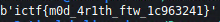

# Lines
## Description
Try to crack my unbreakable™ encryption! I based it off of the Diffie-Helman key exchange!

## Files
Provided source code and encrypted messages.

## Code
### `lines.py`
```python
from Crypto.Util.number import bytes_to_long
import random

flag = bytes_to_long(open("flag.txt", "rb").read())
msg = bytes_to_long(b":roocursion:")

p = 82820875767540480278499859101602250644399117699549694231796720388646919033627
g = 2
a = random.randint(0, p)
b = random.randint(0, p)
s = pow(pow(g, a, p), b, p)

def encrypt(msg):
    return (s*msg) % p

print(f"{p = }")
print(f"{encrypt(flag) = }")
print(f"{encrypt(msg) = }")

```

### `lines.txt`
```
p = 82820875767540480278499859101602250644399117699549694231796720388646919033627
encrypt(flag) = 26128737736971786465707543446495988011066430691718096828312365072463804029545
encrypt(msg) = 15673067813634207159976639166112349879086089811595176161282638541391245739514
```

## Methodology
This encryption method resembles diffie-hellman algorithm. We only get `p` and encrypted `flag` and `msg`. Encryption method `encrypt(msg)` uses a secret value `s` that we don't know, `msg` that is a plaintext that we want to encrypt and `p` for modulo which is a big prime number. Since we are given a plaintext (`:roocursion:`) and its encrypted form, we have 2 (`msg`, `p`) out of 3 pieces of the algorithm. We can calculate `s` by reversing this encryption operation (known as `mod inverse`).

When we have `s` we can decrypt encrypted `flag` since again we now have 2 pieces (`s`, `p`) of the algorithm. Now we get plaintext flag.

## Code
```python
from Crypto.Util.number import bytes_to_long, long_to_bytes

def modinv(x, m):
  return pow(x, -1, m)

msg = bytes_to_long(b":roocursion:")
p = 82820875767540480278499859101602250644399117699549694231796720388646919033627
enc_flag = 26128737736971786465707543446495988011066430691718096828312365072463804029545
enc_msg = 15673067813634207159976639166112349879086089811595176161282638541391245739514

s = (enc_msg * modinv(msg, p)) % p
flag = (enc_flag * modinv(s, p)) % p
print(long_to_bytes(flag))
```

## Loot


## Flag
**ictf{m0d_4r1th_ftw_1c963241}**