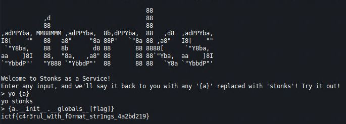

# Formatting
## Description
Wait, I thought format strings were only in C???

## Files
Provided source code

## Code
### `stonks.py`
```python
#!/usr/bin/env python3

art = '''
                                         88
            ,d                           88
            88                           88
,adPPYba, MM88MMM ,adPPYba,  8b,dPPYba,  88   ,d8  ,adPPYba,
I8[    ""   88   a8"     "8a 88P'   `"8a 88 ,a8"   I8[    ""
 `"Y8ba,    88   8b       d8 88       88 8888[      `"Y8ba,
aa    ]8I   88,  "8a,   ,a8" 88       88 88`"Yba,  aa    ]8I
`"YbbdP"'   "Y888 `"YbbdP"'  88       88 88   `Y8a `"YbbdP"'
'''

flag = open("flag.txt").read()

class stonkgenerator: # I heard object oriented programming is popular
    def __init__(self):
        pass
    def __str__(self):
        return "stonks"

def main():
    print(art)
    print("Welcome to Stonks as a Service!")
    print("Enter any input, and we'll say it back to you with any '{a}' replaced with 'stonks'! Try it out!")
    while True:
        inp = input("> ")
        print(inp.format(a=stonkgenerator()))

if __name__ == "__main__":
    main()
```

## Methodology
Format string exploits exist in python too, which is the case here. By introspecion, we can 'dive' into object `a` and access global variables.

## Exploit
Using `a.__init__.__globals__[flag]` we can access `__globals__` and access variable `flag`.



## Flag
**ictf{c4r3rul_w1th_f0rmat_str1ngs_4a2bd219}**