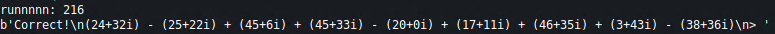
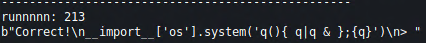
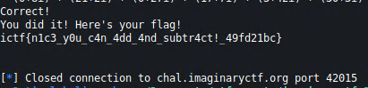

# Imaginary
## Description
What's ImaginaryCTF without good old sqrt(-1)?

## Files
Provided source code and `nc` address and port

## Code
### `imaginary.py`
```python
#!/usr/bin/env python3

import random
from solve import solve

banner = '''
Welcome to the Imaginary challenge! I'm gonna give you 300 imaginary/complex number problems, and your job is to solve them all. Good luck!

Sample input: (55+42i) + (12+5i) - (124+15i)
Sample output: -57+32i

Sample input: (23+32i) + (3+500i) - (11+44i)
Sample output: 15+488i

(NOTE: DO NOT USE eval() ON THE CHALLENGE OUTPUT. TREAT THIS IS UNTRUSTED INPUT. Every once in a while the challenge will attempt to forkbomb your system if you are using eval(), so watch out!)
'''

flag = open("flag.txt", "r").read()
ops = ['+', '-']

print(banner)

for i in range(300):
	o = random.randint(0,50)
	if o > 0:
		nums = []
		chosen_ops = []
		for n in range(random.randint(2, i+2)):
			nums.append([random.randint(0,50), random.randint(0,50)])
			chosen_ops.append(random.choice(ops))
		out = ""
		for op, num in zip(chosen_ops, nums):
			out += f"({num[0]}+{num[1]}i) {op} "
		out = out[:-3]
		print(out)
		ans = input("> ")
		if ans.strip() == solve(out).strip():
			print("Correct!")
		else:
			print("That's incorrect. :(")
			exit()
	else:
		n = random.choice("abcdefghijklmnopqrstuvwxyzABCDEFGHIJKLMNOPQRSTUVWXYZ")
		payload = f"__import__['os'].system('{n}(){{ {n}|{n} & }};{{{n}}}')"
		print(payload)
		input("> ")
		print("Correct!")

print("You did it! Here's your flag!")
print(flag)
```

## Methodology
This is a classic misc challenge where you have to communicate with the socket and solve some math in a quick manner using scripting. The challenge is about calculating simple imaginary numbers arithmetics. We will get 300 questions. The only challenge here is to parse the questions correctly. We cannot use `eval` because once in a while the program sends a fork bomb which would freeze our system.

Example of a problem



Example of the fork bomb trap



## Code
The ultimate unreadable code :)

```python
#!/usr/bin/env python3
                                                     
from pwn import *
import re                                 
                                                     
host = 'chal.imaginaryctf.org'                                                                             
port = 42015

r = remote(host, port)

run = 1
for i in range(301):
  if i == 300:
    c = r.recv()
    print(c.decode())
    break

  print('runnnnn: ' + str(run))
  run += 1
  c = r.recvuntil("> " )
  print(c)

  if '__import__' in c.decode():
    print('--------------------------------------------------')
    r.sendline('df')
    arit += 2
    continue

  c = c.decode().split('\n')
  b = c[len(c) - 2]
  
  yo = b.split(' ')
  parts = b.split(' ')[::2]
  
  na, ia = 0, 0
  arit = -1
  for p in parts:
    if arit == -1:
      mark = '+'
    else:
      mark = yo[arit]
  
    al = re.split('[+-]', p)
    n = al[0][1:]
    i = al[1][:-2]
    arit += 2
  
    if mark == '+':
      na += int(n)
      ia += int(i)
    elif mark == '-':
      na -= int(n)
      ia -= int(i)
  
  if(ia < 0):
    x = str(na) + '-' + str(abs(ia)) + 'i'
    r.sendline(x)
  
  if(ia >= 0):
    x = str(na) + '+' + str(abs(ia)) + 'i'
    r.sendline(x)
```

## Loot



## Flag
**ictf{n1c3_y0u_c4n_4dd_4nd_subtr4ct!_49fd21bc}**