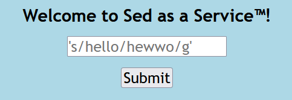
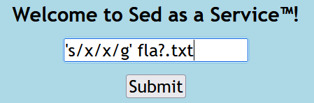
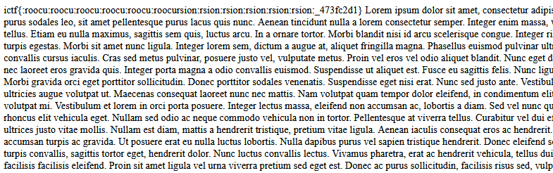

# SaaS
## Description
Welcome to Sed as a Service! Now you can filter lorem ipsum to your heart's desire!

## Files
Provided source code

## Code
### `app.py`
```python
from flask import Flask, render_template, request
import html
import os

app = Flask(__name__)

@app.route('/')
def index():
    return render_template('index.html')

blacklist = ["flag", "cat", "|", "&", ";", "`", "$"]

@app.route('/backend')
def backend():
    for word in blacklist:
        if word in request.args['query']:
            return "Stop hacking.\n"
    return html.escape(os.popen(f"sed {request.args['query']} stuff.txt").read())
```

## Methodology


We can submit a query to be used in a `sed` command. The query will be used on the file `stuff.txt`. We cannot use disallowed chars in the `blacklist`. No way to end command and run our own or to pipe commands. We can however input our own file after the query like this.

`'s/hello/hewwo/g' lol.txt`

which will form

`sed 's/hello/hewwo/g' lol.txt stuff.txt`

using our filename and ignoring `stuff.txt`.

Flag is in `flag.txt` file but we cannot use the name `flag` because we will get blocked. Wildcards to the rescue! We can use `?` to substitute one character in the filename. Now we won't get blocked.

## Exploit
We send this input to the the flag `'s/x/x/g' fla?.txt`



## Loot


## Flag
**ictf{:roocu:roocu:roocu:roocu:roocu:roocursion:rsion:rsion:rsion:rsion:rsion:_473fc2d1}**