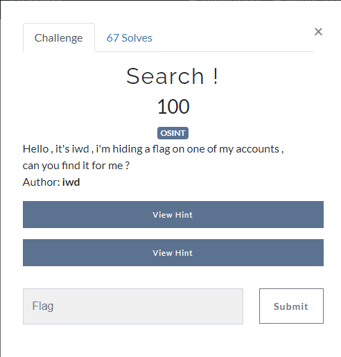
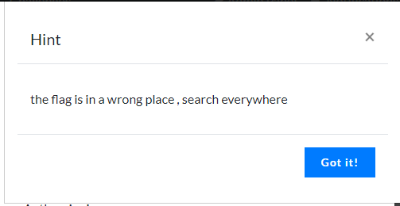
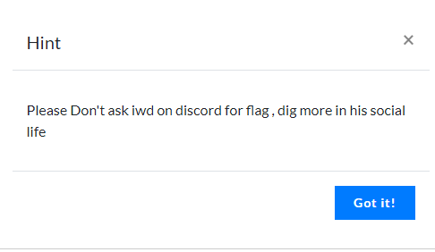

# Search !
Challenge description


Hint #1


Hint #2


So basically find account of 'iwd' on the internet.

# Sherlock
Very good tool to find accounts on the internet is: [Sherlock](https://github.com/sherlock-project/sherlock)

```sh
$ python3 sherlock iwd --print-found > accounts.txt
```

Searching for account 'iwd' yielded many results but none of them seemed to give answer to the challenge, so i started from scratch.

# Searching manually
I searched for the official website of the team that made this ctf: [from Sousse, with love](https://www.sousse.love/)
There is a team section showing all team members. Bingo, there he is: [iwd](https://www.sousse.love/authors/iwd/)
He has only FB and Instagram links. Facebook is broken and Instagram doesn't have anything resulting in a flag. But we have his name.

Basis google search yields couple answers. We are looking for social accounts so best matches are LinkedIn (flag not there) and Youtube.

I searched his videos and comments but nothing useful there. He has a Youtube About page. The only interesting thing there is the e-mail. You have to be logged-in and solve a Captcha to view it but there is the flag :)


# Flag
**Posedion{U_Sh0uld_D1g_B3tt3r}**
